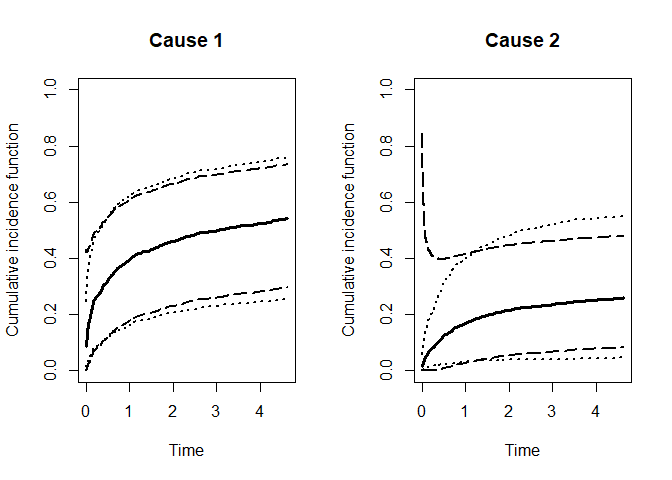

<!-- README.md is generated from README.Rmd. Please edit that file -->

# ClusteredMPPLE

<!-- badges: start -->

<!-- badges: end -->

The ClusteredMPPLE conducts semiparametric marginal regression for
clustered competing risks data with missing cause of failure. It
implements the proposed maximum partial pseudolikelihood estimation
method by Zhou et al.(2021) based on semiparametric marginal
proportional cause-specific hazards model. The standard errors for the
estimated regression coefficients are calculated based on the close-form
variance or bootstrapping. It also calculates and generates cumulative
incidence functions and cumulative residual processes plots.

## Installation

You can install the development version from
[GitHub](https://github.com/) with:

``` r
# install.packages("devtools")
devtools::install_github("wz11/ClusteredMPPLE")
```

## Dependencies

The `survival` package should be installed and loaded before usage.

## Example

This is a basic example which shows you how to solve a common problem:

``` r
library(survival)
library(ClusteredMPPLE)

# Load simulated dataset
data("pseudo_HIV_data")

# Fit the model 
fit <- ccr_smreg(data = pseudo_HIV_data, 
                 formula1 =  y ~ x + Sex + Age + CD4 + HIV, 
                 formula2 =  Surv(x, d) ~ Sex + Age + CD4 + HIV,
                 cluster = "clusterid",
                 ics.weight = TRUE, 
                 var.method = "BS", 
                 nboot = 1000)
#> please wait...
# Obtain model summary
summary(fit)
#> 
#> cause 1: 
#>            beta         se    p-value exp(beta) 95% CI lower limit
#> Sex -0.30750563 0.12693692 0.01541381 0.7352787          0.5733253
#> Age -0.06688223 0.05563487 0.22930003 0.9353053          0.8386796
#> CD4 -0.01359908 0.03139703 0.66491839 0.9864930          0.9276162
#> HIV -0.17834308 0.12092280 0.14025268 0.8366553          0.6601080
#>     95% CI upper limit
#> Sex          0.9429809
#> Age          1.0430636
#> CD4          1.0491068
#> HIV          1.0604206
#> 
#> cause 2: 
#>            beta         se      p-value exp(beta) 95% CI lower limit
#> Sex  0.02290532 0.18507360 9.015027e-01 1.0231697          0.7118850
#> Age -0.02613823 0.07674342 7.334104e-01 0.9742004          0.8381524
#> CD4 -0.25748745 0.06101681 2.443641e-05 0.7729913          0.6858609
#> HIV  0.06250295 0.23003162 7.858415e-01 1.0644976          0.6781688
#>     95% CI upper limit
#> Sex          1.4705693
#> Age          1.1323316
#> CD4          0.8711906
#> HIV          1.6709042

# Calculate and plot cumulative incidence function
pfit <- cif.ccr_smreg(fit, band = TRUE, sims = 1000)
plot(pfit)
```



``` r

# Calculate and plot cumulative residual process
rfit <- crp.ccr_smreg(fit)
plot(rfit)
```


## Reference

  - Zhou, W., Bakoyannis, G., Zhang, Y., & Yiannoutsos, C. T. (2021).
    Semiparametric Marginal Regression for Clustered Competing Risks
    Data with Missing Cause of Failure. arXiv preprint
    arXiv:2104.09090.(<https://arxiv.org/abs/2104.09090>)
